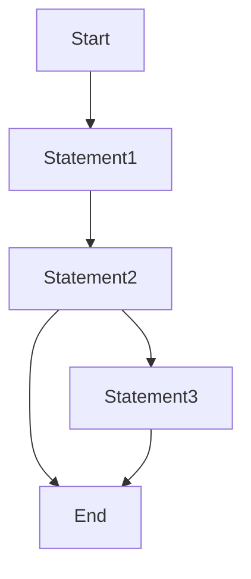

# 📈Schedule

> [!NOTE]
>  :bulb: 個人Schedule 論壇/比賽 紀錄

# Table of Contents

[TOC]

# Dynasafe ADN 
## 2022/08/01-2023/08/18
# 2023神盾盃資安論壇
## 2023/11/02
主辦單位：中山科學研究院
https://aegisctf.kktix.cc/events/2023aegiscof

# 台科資安社-滲透測試工作坊
## 2023/11/04
[HackMD Note](https://hackmd.io/@CHW/B1TblYz76)

# 2023 T貓盃全國資安基礎實務能力競賽 
## 初賽: 2023/11/10-13
## 決賽: 2023/11/23 佳作
# HITCON Carnival 2023 攻防演練論壇 & 賽況導覽
## 2023/11/14
指導單位：數位發展部數位產業署、社團法人台灣駭客協會\
主辦單位：社團法人台灣駭客協會、工業技術研究院\
競賽地點：臺北文創大樓 6 樓 (臺北市信義區菸廠路 88 號 )\
競賽時間：2023 年 11 月 14 日（星期二）09:00 - 17:00\
論壇時間：2023 年 11 月 14 日（星期二）10:50 - 17:10（10:30 開始報到）

# 2023台灣資安通報應變年會 (卡Hitcon 沒參加)
## 2023/11/14
活動主題：韌性資安 永續台灣\
指導單位：數位發展部\
主辦單位：財團法人台灣網路資訊中心、台灣電腦網路危機處理暨協調中心\
協辦單位：國家資通安全研究院\
活動日期：112年11月14日（星期二）上午09時00分至16時00分

# iPAS資訊安全工程師證照 初級
## 2023/11/25 (通過)
# TeamT5 Security Camp 2024 筆試題目
## 2023/11/10-12/01
# 線上資安創新講座-以攻擊策略演練角度協助企業評估、強化與呈現資安投資成效
## 2023/12/02
【活動資訊】\
活動名稱：線上資安專題講座-以攻擊策略演練角度協助企業評估、強化與呈現資安投資成效\
指導單位：教育部資訊及科技教育司\
主辦單位：教育部先進資通安全實務人才培育計畫

活動日期：2023/12/02（六） 14:00 - 16:00\
報到時間：13：30 - 14：00\
活動地點：線上舉辦（活動前一天會提供會議連結至報名者的電子信箱）

【活動時程表】\
13:30 - 14:00 講師、與會者報到入場\
14:00 - 14:05 活動開場\
14:05 - 15:30 專題講座\
15:30 - 15:50 QA座談時間\
15:50 - 16:00 結語

[專題講座PDF](https://fjuedu-my.sharepoint.com/:b:/g/personal/fj03898_m365_fju_edu_tw/EV4A0naaYB1Ao0_yaaL7JHYBgdM7zNopZJrytUqSQGYzVA?e=MlmfxY) 

# 2023 CGGC 網路守護者挑戰賽-- Cyber Guardian Grand Challenge
## 初賽: 2023/12/01-02
指導單位：國家科學及技術委員會\
主辦單位：財團法人國家實驗研究院國家高速網路與計算中心\
執行單位：NDS 次世代創新數位安全協會\
協辦單位：工業技術研究院

賽制說明：
1. 為 36 小時 (12.01 10:00 ~ 12.02 22:00) 的線上競賽
2. 以 Jeopardy 形式 CTF 競賽採取積分累計制，依分數高低進行排名
3. 同分者，依最後一次正確提交的時間判定
4. 每道題目的分數將會根據解題隊伍數即時進行動態調整
5. Flag 形式為 CGGC{}
6. 每位參賽者最多僅能參與一個隊伍
7. 競賽期間做出以下違規事項者將直接取消資格，進行任何破壞競賽公平公正原則之行為，包含不僅限於：\
(1) 於比賽結束前散播、與其它隊伍交換解法或 Flag\
(2) DDoS 或惡意攻擊意圖使題目或計分平臺癱瘓者\
(3) 除競賽中提供的題目外，對競賽系統、參賽者及其它人員進行攻擊者

●WriteUP:  https://hackmd.io/@CHW/BJJ_NAIB6

# [EDU-CTF] Computer Security 2023 Fall Course: WEB
## 2023/12/01-15
WRITE UP:

### ● [[Web] Computer Security 2023 Fall Course](https://hackmd.io/@CHW/ryPzhx0H6)

### ● [[Web-lab] Computer Security 2023 Fall Course](https://hackmd.io/@CHW/SkYei2sPp)

# HackTheBox: University CTF 2023: Brains & Bytes
## 2023/12/08-10(UTC)
[University CTF 2023: Brains & Bytes](https://www.hackthebox.com/universities/university-ctf-2023)

RULES OF THE GAME:
Don’t Become a Creature of the Night
1. Only students currently enrolled in a bachelor’s or master's program can participate in this event.
2. Do not attack the backend infrastructure of the CTF.
3. Do not attack other teams playing in the CTF.
4. Do not brute-force the flag submission form.
5. Do not exchange flags or write-ups/hints of the challenges with other teams.
6. Do not violate HTB's Terms of Service.
7. Do not try to DDoS the challenges or make actions that could lead to this result. For example, brute force or use of automated tools with many threads.
8. Do not be part of more than one team within the same CTF.
9. Each University can participate/be represented by one team only.

# AIS3 EOF CTF 2024
## 初賽: 2024/01/05-07
時程\
報名時間：112 年 11 月 13 日上午 9 時至 112 年 12 月 15 日下午 17 時止\
初賽時間：113 年 1 月 5 日上午 9 時至 113 年 1 月 7 日下午 17 時前。\
錄取通知：113 年 1 月 17 日前通知與公告。\
決賽時間：113 年 2 月 3 日至 4 日假中華電信學院板橋所進行。\
活動時程

競賽說明\
訂於 113 年 1 月 5 日上午 9 時至 1 月 7 日下午 17 時辦理，共計 3 日。\

競賽方式：以解題型CTF競賽為主，採線上競賽方式進行。\
依初賽結果總排名，錄取 80 名、備取 20 名進入決賽，最終錄取結果將於 113 年 1 月 17 日 (三) 前以 e-mail 方式個別通知，並將最終錄取名單公告於 AIS3 EOF 首頁。\
決賽：於 113 年 2 月 3 日 (六) 至 4日 (日) 假中華電信學院板橋所進行。\
(1) 競賽方式：以解題型CTF競賽為主，關卡與比賽規則以錄取後公告說明為主。\
(2) 由錄取決賽的學員，以團隊為單位，每隊 4-5 人組隊參賽，決賽組隊方式將於初賽後再公布。\
(3) 參賽隊伍須攜帶電腦設備，亦可攜帶競賽所需之各式電腦軟硬體工具或儲存媒體。\
(4) 競賽獎勵：依解題總得分高低，以計畫辦公室名義頒發獎狀，同分者以完成時間較短之隊伍為優先排名。

＊金獎：1 隊，獎狀乙紙。\
＊銀獎：1 隊，獎狀乙紙。\
＊銅獎：1 隊，獎狀乙紙。\
＊潛力獎：若干名，獎狀乙紙。\

(5) 表現優異團隊，經評審推薦，可優先錄取參加AIS3 2024課程並獲得由教育部補助出國參加國際資安競賽機會。\
(6) 若參賽分數未達評審標準，經決議，獎項名次得從缺。\
(7) 參賽證明：凡全程參與比賽者可頒發參賽證書。\
(8) 比賽詳細議程以及本報名須知若有其他未盡事宜，或有任何變更或修改，則依主辦單位公告為主。
## 決賽: 2024/02/03-04
## 請隊長在30秒內回覆 第七名
指導單位：教育部資訊及科技教育司\
主辦單位：教育部先進資通安全實務人才培育計畫推動辦公室\
協辦單位：國立臺灣科技大學資訊管理系、國立臺灣科技大學資訊工程系、國立陽明交通大學資訊工程學系、國立臺灣大學資訊工程學系、國立中正大學資訊工程學系、國立臺北科技大學資訊工程系

同學您好:
恭喜您成為112年度AIS3 EOF進階資安攻防演練決賽隊伍。
本次賽程將於2/3(六)及2/4(日)2天在中華電信學院板橋所舉行，詳細決賽議程如下

【AIS3 EOF報到注意事項】
一、決賽地點：中華電信學院板橋所會館B1樓CB100教室-新北市板橋區民族路168號。\
 (交通資訊https://www.chtti.cht.com.tw/portal/traffic_info_banqiao.jsp)

二、報到時間:113年2月3日上午09時30分至10時。

三、報到時請出示學生證，經發現繳交資料不實或有冒用身分之不法情事，一律喪失資格，並請自負法律責任。

四、競賽所需電腦設備及各式電腦軟硬體工具或儲存媒體，由參賽者自行預備。

五、本次競賽將提供決賽參賽學員 113 年 2 月 3 日於中華電信學院板橋所之住宿。(註：以雙人房為主，並由主辦單位安排分配。)

六、交通費補助：若非大臺北地區的學生，補助比賽往返板橋的長途交通費，如高鐵（標準車廂）、火車、國道客運等，需憑單據/票根實支核銷。

七、主辦單位保有修改、變更或暫停本活動之權利，如有未盡事宜，悉依主辦單位相關規定或解釋辦理，並得隨時補充公告之。

【AIS3 EOF競賽注意事項】

一、參賽者於競賽中不得進行網路攻擊或干擾競賽等行為(如攻擊主機、scoreboard 等)。

二、參賽者不得以任何方式干擾其他隊伍。

三、參賽者不得於短時間內蓄意送大量 flag。

四、參賽隊伍於競賽期間如違反競賽規則或破壞競賽秩序，經主辦方認定後，情節嚴重者得直接取消競賽資格，參賽隊伍不得異議。

五、本競賽為榮譽競賽，請依原報名隊伍組成參與，若有代打等作弊狀況，經發現得直接取消競賽資格，參賽隊伍不得異議

六、參加本競賽活動者，視同意遵守本競賽要點內所述之所有事項。

### [賽後解說大會](https://docs.google.com/presentation/d/1YWIU_xWPs5UciSGSe1mTHLWCFA5-EyPq1yyxWdIm3OU/edit)

# 2024 TSCCTF (Taiwan Security Club Capture the Flag)
## 初賽: 2024/01/19-22
一、活動時間:
自 2024 年 1 月 19 日上午 10 時至 2024 年 1 月 22 日上午 10 時止,共計
72 小時。

二、競賽方式:\
競賽採 Jeopardy 模式,以線上個人競賽方式進行。\
競賽平台:https://ctfd.tscctf.com/\
Discord 討論群:https://discord.gg/2NuK5XKYP3\

三、獎項說明:\
為鼓勵參賽成績優異者,主辦單位提供下列獎項和相關獎品:\
1. 總體前三名:於競賽中具有獎金資格參賽者中排名前三名。
2. 各校前三名:於競賽中具有獎金資格參賽者中於各校排名優異者,\
依各校報名人數決定各校獎項名額。\
⚫ 一校獎金資格參賽者大於十人,取前三名。\
⚫ 一校獎金資格參賽者大於五人,取前兩名。\
⚫ 一校獎金資格參賽者不足五人,取一名。\
備註:一參賽者僅得一獎項,因此若參賽者排名為總體前三且為各校排名優異者,僅採總體前三之獎項,各校排名優異獎項則依序向前遞補。\

四、競賽獎勵:
1. 總體前三:
HITCON 門票
DEVCORE 悠遊卡
DEVCORE 2023 研討會款灰色 T-shirt 一件
DEVCORE 徽章
DEVCORE 紀念杯墊
2. 各校表現優異:
Hack The Box 一個月 VIP 禮物卡
五、頒獎暨交流會:
為鼓勵成績優異之參賽者,主辦單位將於國立陽明交通大學舉行頒獎
典禮及交流活動,並補助得獎參賽者車馬費。未得獎者亦歡迎前來一同參
與實體交流活動,但交通需自費。詳細活動內容如下:
1. 日期:2024 年 2 月 2 日
2. 時間:上午 10 時至下午 2 時 30 分
3. 地點:國立陽明交通大學工程三館 EC329
4. 交通費補助:補助大眾運輸(台鐵、高鐵、公車、捷運)費用,依票
據實報實銷,單程上限 1,200 元。
5. 交流會流程表:\
時間 流程大綱\
10:00 - 10:30 報到\
10:40 - 10:50 總召致詞\
10:50 - 11:10 頒獎儀式\
11:10 - 11:30 出題組分享\
12:00 - 13:00 午餐茶會\
13:00 - 14:30 經驗分享會\
14:30 - 15:10 贊助廠商徵才宣傳(一)\
15:10 - 15:25 中場休息\
15:25 - 16:05 贊助廠商徵才宣傳(二)\
16:05 - 大合照
# Cyber Apocalypse 2024: Hacker Royale
##  2024/03/09-13
https://ctf.hackthebox.com/event/details/cyber-apocalypse-2024-hacker-royale-1386

**Event Overview**\
"We used to be peaceful and had enough tech to keep us all happy. What do you think about that? 

These data disks alluded to some "societal golden age." No fighting, no backstabbing, and no factions fighting for some lousy title.

Good, great for them-
Because all we get to look forward to is "The Fray."

*alarms blaring*

Oh, look-... it's showtime." (Quote: Luxx, faction leader of the Phreaks)

💥 Welcome to "The Fray." A societal gauntlet made of the most cunning, dedicated, and bloodthirsty factions. We are all bound by the same rule–be one of the last factions standing. All brought to your overlords and sponsors at KORP™.

Our city's lights bring people from far and wide. It's one of the last remaining mega structures left after the Great Division took place. But, as far as we are concerned, KORP™ is all there ever was and will be. 

They hold The Fray every four years to find the "best and the brightest around." Those who make it through their technological concoction of challenges become the "Legionaries," funded factions who get to sit on easy-street for the time between the next fight.

# picoCTF 2024
##  2024/03/13-27
https://play.picoctf.org/events/73

What are the Team prizes?\
Subject to these Competition Rules and the Terms of Use, the Team prizes will be:

> 1st place: $3,000 and may have opportunity to visit Carnegie Mellon University's Pittsburgh campus for an award ceremony\
>2nd place: $2,000 and may have opportunity to visit Carnegie Mellon University's Pittsburgh campus for an award ceremony\
> 3rd place: $1,000and may have opportunity to visit Carnegie Mellon University's Pittsburgh campus for an award ceremony\
> Highest placing all middle school Team: $500\
> 2nd highest placing all middle school Team: $300\
> 3rd highest placing all middle school Team: $150

### ● [picoCTF 2024 Writeup](https://hackmd.io/@CHW/Byha19Apa)

# DEVCORE CONFERENCE 2024
## 2024/03/16
https://conf.devco.re/2024/agenda/ \
**活動資訊**\
時間：\
2024/03/16（六）08:40 - 16:20\
地點：\
TICC 台北國際會議中心 201 會議室（台北市信義區信義路五段 1 號） \

**議程介紹**\
本次研討會將分享最新的漏洞研究和真實紅隊演練案例，其中包括 WAF 的繞過、AD 網域安全、新的攻擊向量、Pwn2Own 經驗、以藍隊從業人員的視角分享紅隊攻擊思路，以及紅隊演練工具開發指南等獨特議題。

### 1. 分分鐘拿下整個網域－關於 AD，你還疏忽了什麼？
> Vtim | DEVCORE 紅隊隊長

根據戴夫寇爾近一年半紅隊演練的結果，高達 5 成企業內網存在 Active Directory 憑證服務（AD CS）相關的設定疏失，導致攻擊者能在僅擁有低權限的網域帳號情況下，迅速在數分鐘內獲得網域的最高控制權。本次演講將去識別化展示各企業在設定上的常見疏失及攻擊者如何利用這些弱點，以強調 AD CS 服務為近年來企業內網中最需要定期檢核的關鍵基礎設施之一，並提供防止錯誤設定的方法，以及特殊情況下的緩解策略。

### 2. 牆の調查：致 WAF 前的你
> Mico | DEVCORE 資深紅隊演練專家

“WAF” 作為一種已臻於成熟的技術產品，不僅是抵禦網路威脅的高壘深塹，其發展速度也猶如是向紅隊發出了挑戰。本議程將回顧早期的繞過技巧，以及介紹至今紅隊專家如何鑿壁偷光？議程中將簡單解析 WAF 的基本原理，探討紅隊如何在實際情況中，成功讓關鍵請求繞過這些安全措施。亦會分享一些從實戰中提煉出的經驗，包括那些起初看似不可能繞過，卻屢屢成功實現的真實案例。同時也提出了自動變換 IP 位置和多請求的自動化識別繞過輔助工具。最後將從戴夫寇爾視角總結 WAF 在當今網路安全生態中的地位和效力。

### 3. The Art of Cyber Craftsman：紅隊該如何打造自己的利器\
>Inndy | DEVCORE 資深開發工程師

執行滲透測試與紅隊演練時，往往需要各式各樣的網路代理與後門工具，市面上的工具可能無法完美滿足需求，常見的工具又經常被防毒軟體與 EDR 阻擋，自己打造紅隊工具能滿足客製化的需求並大幅降低被偵測的機率。這場議程講者會基於過去分析惡意程式的經驗，分享開發紅隊工具的心得、技巧，幫助大家降低自行研發紅隊工具的門檻。

### 4. 《轉生赤隊：異世界網際穿越之旅》
> Linwz | DEVCORE 紅隊演練專家

在網路安全領域中，企業常著重於防範外部威脅，這通常包括加強外網的網頁服務安全、VPN 服務，並佈置多重防禦系統。然而，在重兵嚴守的背後，往往會忽略一些不那麼明顯的弱點，從而成為安全漏洞的潛在滋生地。本次演講將深入探討紅隊的多個視野維度，揭露那些鮮為人知的攻擊技巧與潛在風險，包括外網情報搜集、內網滲透點、內網偵查技巧以及無線攻擊手段。本議程將以對抗策略貫穿全貌，並以防禦措施的探討作為結尾，期盼這些內容可以協助增強企業的資安思維。

### 5. 當資深藍隊成員，換上紅隊的外衣
> Henry | 奧義智慧 資深軟體架構師

講者 Henry 任職於奧義智慧，負責開發 Unix EDR 核心元件。他日夜觀察各路紅隊手法，撰寫偵測邏輯，做著藍隊工作的同時，Henry 的心裡其實也流著紅隊的熱血。本次 Henry 將分享他見過的紅隊案例中，有趣的手法和背後的偵測邏輯，同時也從藍隊的身份、紅隊的視角，探討可能的攻擊思路。

### 6. LeakLess? Another Leak Way in Windows Kernel DFSC. 
>Angelboy | DEVCORE 資深資安研究員

在日常使用的 Windows 系統中，net use 命令扮演著不可或缺的角色。這個命令簡單卻功能強大，讓使用者能夠輕鬆連接到各種網路資源，例如共享文件夾。DFSC（Distributed File System Client）便是 net use 命令背後的核心機制之一。本議程將深入探討一個在 Windows Kernel 的 DFSC 中被發現的漏洞。這個漏洞原本被認為幾乎無法被利用，但經過一系列的操作和分析後，將這種看似不可能的情況變成了可能：講者成功利用該漏洞實現了 Information Leakage，特別是在 Windows Kernel 保護越來越多的情況下，更突顯了這個漏洞的潛在風險和影響。

### 7. 第一次打 Pwn2Own 就 SOHO Smashup 是不是搞錯了什麼？
> LJP & YingMuo | DEVCORE 實習生（Pwn2Own Toronto 2023 第三名）

DEVCORE 實習生導師 Angelboy 曾經說過一句話：「Pwn2Own IoT 那場還蠻適合第一次挖掘 Real World 漏洞的人打」，於是本議程講者（DEVCORE 實習生）就以 Pwn2Own 作為實習階段目標，並且一舉拿下世界第三。此議程中將講述這次參賽是如何成功串起從 WAN 端 TP-Link ER605 Router 到 LAN 端 QNAP TS-464 NAS 的攻擊，並分享從目標挑選、研究、發現漏洞然後最後幾天被官方 patch 的過程，以及講者如何在報名截止前兩天加班趕工找到新漏洞並成功利用。本議程提及的漏洞較少被關注，相信無論是開發者或研究員都能有所收穫，敬請期待。

# Asian Cyber Security Challenge 2024
## 2024/03/30-31

# CYBERSEC 2024 臺灣資安大會
2024 年 5 月 14 日 (二) 至 5 月 16 日 (四) 由 iThome 主辦的 CYBERSEC 2024 臺灣資安大會

報到時間：5/14 (二)、5/15 (三)、5/16 (四) 皆為 08:00 起開放報到\
報到地點：南港展覽二館 1 樓《Cyber Talent》大會服務台（台北市南港區經貿二路 2 號）\
交通資訊：https://www.tainex.com.tw/service/transportation/drive \
大會官網：https://cybersec.ithome.com.tw/2024/

## 2024/05/14
### 以生成式 AI 輔助對抗進階持續威脅 (台大)
> 許凱平 / 國立臺灣大學計算機及資訊網路中心 作業管理組 副組長

這場演講中將揭示生成式 AI（如 ChatGPT）在對抗進階持續威脅（APT）中的關鍵作用。APT 是針對性強、持續時間長的網路攻擊，涉及潛伏、資料竊取等多重威脅。我們將深入探討 AI 在偵測、分析、回應和預測這些攻擊中的應用。從自動分類偵測事件，到識別網絡異常， AI 幫助揭露攻擊者策略，並提出有效的防禦措施。此演講將展現 AI 如何提高資安效能，並與資安專家的見解結合，共同提升防禦策略。

### 台灣語言模型於資安的應用：適用性與性能全方位探討 (奧義)
> 陳樞元 (Coco chen) / 奧義智慧科技 Data Scientist

本議程將從多個面向 ( e.g., 無害性和本土化 ) 評估不同模型於台灣資安領域應用的能力，分析 TAIDE、Taiwan LLM 和奧義智慧研發的 LLM-CyCraftGPT 等不同模型的表現，了解它們在應對各種問題時的適用性 ，幫助聽眾在未來能更快速選擇適合的模型。

### LLM 對抗性攻擊 - 網絡安全專家不應忽視的威脅 (OneDegree)
> 周彥儒 (Stanley Chou) / OneDegree 資安長

在此演講中，講者將闡明如何通過對抗性攻擊來誤導大語言模型（LLM）。講者將涵蓋常見的 LLM 應用案例，重點說明技術所產生的新興威脅，深入探討 LLM 對抗性攻擊後，通過實際案例來說明可能之負面影響。演講將介紹 LLM 安全與合規測試的概念，強調此類測試在評估和增強 LLM 安全性以提高可信任 AI 方面的關鍵作用。最終，此演講旨在提高觀眾對於 LLM 技術風險的理解，並鼓勵採取積極策略以防範此類對抗性威脅。

## 2024/05/15
### 資安比賽的冒險之旅：培養專業人才、職涯發展的跳板 (Cymetrics)
> 尤理衡 (Li-Heng Yu) / Cymetrics Security Engineer

這場演講結合了自身的經驗，以資訊安全競賽作為切入，講述資安相關的教育、專業人才培養及職涯發展。我將分享在比賽中的學習歷程，探討資訊安全競賽如何成為培育下一代安全專業人才的重要途徑。演講將著重於轉化比賽經驗為實際工作技能，強調競賽路途中所學到的技能在資安領域的實用性。通過個人真實的比賽案例，參與者將獲得實用的見解，並能夠更全面地理解資安領域的挑戰與機會。
> 第一次看到seadog007大佬本人

### 30 分鐘看完資安工程師的一年：滲透案例解析與統整 (Cymetrics)
> Zet / Cymetrics Security Team Leader\
> Nick Nick / Cymetrics Senior Security Engineer

在 2023 年執行 30+ 客戶，超過 180+ 個滲透測試標的，從中我們發現了不少有趣的案例，包括 AI chatbot jailbreak、超過 20 年古老 CMS 的內網滲透。在 2023 年中我們主要測試的產業別為：金融, 遊戲, 餐飲。我們平均每個測試專案都可以找到至少 1 High, 1 Medium, 1 Low 的安全風險，我們將探討這其中的風險項目與統計解析。在過程中我們嘗試增進專案的執行速度與優化測試流程，希望可以與同業分享與交流。

> Cymetric 吉祥物?!\
> 放大一點看

> 水豚君

### 框架化你的紅隊成果！從問題解決到長期資安策略 (Devcore)
> 翁浩正 / DEVCORE 執行長\
> 張亭儀 / DEVCORE 商務發展經理

「我的企業真的安全嗎？」一直是企業在紅隊演練後難以回答的問題。企業常僅止於解決短期問題，而難以融入長期的資安策略。在這場演講，我們將透過百場紅隊經驗的觀察，提出企業遇到的困境，反思過去的問題。為此我們也將介紹一個框架化紅隊演練成果的新方法，如同在戰場上畫出格線，幫助企業突破僅能單點式、解決短期問題的窘境，有效發揮紅隊演練的完整效益。進一步更能幫助資安長、資安團隊強化未來資安策略的完整性。

## 2024/05/16

# 台科資安社- 開箱！紅隊演練專家的職涯經驗
## 2024/05/16
想要一探資安專家的工作日常並深入了解他們如何在國際舞台上大放異彩嗎？那你絕不能錯過這次的社課，我們有幸邀請到資深紅隊演練專家高敏睿 Mico 親自分享他的豐富經驗！

🗓️ 日期：05/16（四）\
⏰ 時間：19:00~21:00\
📍 地點：TR-209\
🎤 講師：高敏睿 - Mico\

👥 主辦單位：國立臺灣科技大學資訊安全研究社\
🤝 協辦單位：臺北市立復興高級中學資訊多媒體社\

🎤 講師資訊：
- 資深紅隊演練專家
- 國際技能競賽 網路安全職種 世界銀牌

# AIS3 Pre-exam CTF 2024
## 初賽: 2024/05/25-27
**活動時程**\
一、 Pre-exam 資安實務測驗報名時間：113 年 4 月 17 日上午 10 時至 113 年 5 月 2 日下午 6 時止。\
二、 Pre-exam 資安實務測驗日期：113 年 5 月 25 日上午 10 時 30 分至 113 年 5 月 27 日下午 5 時前。\
三、 Pre-exam 錄取通知：113 年 6 月 30 日前通知與公告。\
四、 甄選報名及資料繳交時間： 113 年 4 月 17 日上午 10 時至 113 年 6 月 5 日下午 6 時止\
五、 甄選錄取通知：113 年 7 月 12 日前通知與公告。\
六、 課程時間：113 年 7 月 29 日至 8 月 4 日，共計 7 日。

**課程時間與地點**\
一、 113 年 7 月 29 日至 8 月 4 日，共計 7 日於國立陽明交通大學進行其中 8 月 3 日至 8 月 4 日進行產業專題導向之資安實務課程及專題展示，學員以分組方式進行。課程以每日上午9時30分至下午5時為原則，實際時間依當日課程安排進行微調，共計 30 小時。\
二、 上課地點：國立陽明交通大學光復校區資訊館國際會議廳。\
三、 主辦單位有權調整課程內容與進行方式或取消課程，若有相關異動將公布於本網頁，恕不另行通知。

**報名資格**\
一、 具備資訊安全基礎能力之本國籍在校學生\
二、 國中時期、高中時期、大學時期皆可報名參加AIS3新型態資安暑期課程2次。\
三、 主辦單位將視報名狀況，保留部分學員名額調整權利。

指導單位：\
教育部資訊及科技教育司\
主辦單位：\
教育部先進資通安全實務人才培育計畫推動辦公室\
協辦單位：\
國立臺灣科技大學資訊工程系、國立臺灣科技大學資訊管理系\
國立陽明交通大學資訊工程學系、國立臺灣大學資訊工程學系\
國立中正大學資訊工程學系、國立臺北科技大學資訊工程系
### 課程時間: 2014/07/29- 08/04

## ---分隔線---
- Status: 
    - [ ] In progress
    - [ ] In review. Reviewer:
    - [ ] Finished

## :triangular_flag_on_post: Problem space

:::success
Describe the problems your users are expecting to solve.
:::

## 📈  Solution space

:::success
Collect ideas that may solve the problems here.
:::

- Idea 1
- Idea 2

## :exclamation: Risks

:::success
List risks and possible hedges.
:::

1. 
2. 

## :feet: Implementation

:::success
Describe how you implement this product, including flow, specs, and design.
:::

### :small_blue_diamond: Flow

:::warning
Create a flow chart to show the process.
:::

### :small_blue_diamond: Specs

:::warning
List the specs for this product.
:::

| **Item**   | **Specs**   | **Note**  |
|:--------:  |:---------:  |:-------:  |
|            |             |           |
|            |             |           |
|            |             |           | 

### :small_blue_diamond: Design
:::warning
Provide the design for this product. You can embed Figma files with this syntax ``, or just paste the embed code here.
:::

## 💬 Open Questions

:::success
Discuss other things that are not on the above. For example, any blind spot on our product specs?
:::

1. 
2. 

### :small_blue_diamond: A checklist for stakeholders 
| Question                                        | Answer |
| ----------------------------------------------- |:------:|
| 1. What is the result you want?                 |        |
| 2. Why is this result important?                |        |
| 3. How will you evaluate progress?              |        |
| 4. How can you influence the result?            |        |
| 5. Who is responsible for the results?          |        |
| 6. How do you know you have achieved your goal? |        |
| 7. How often will you review?                   |        |
